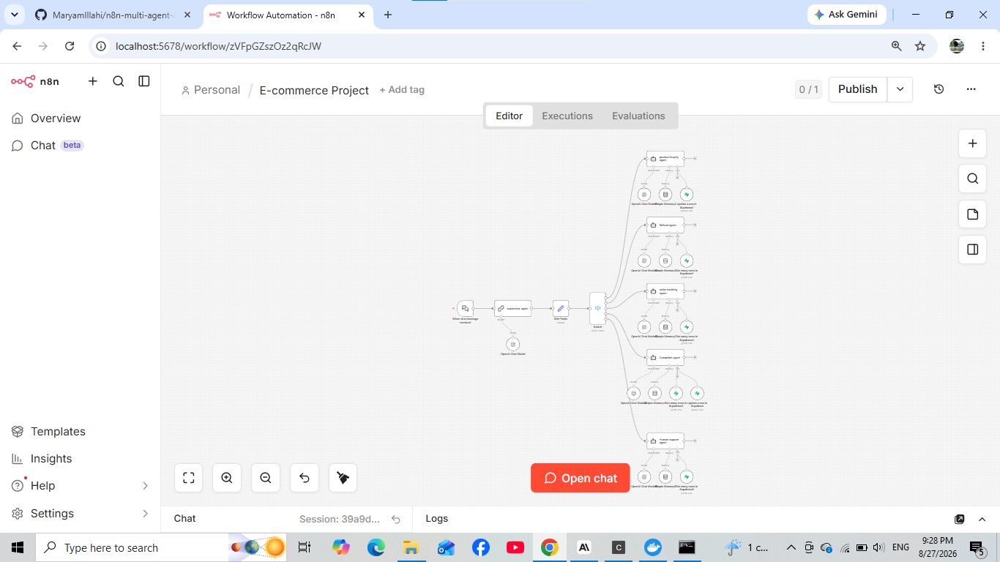
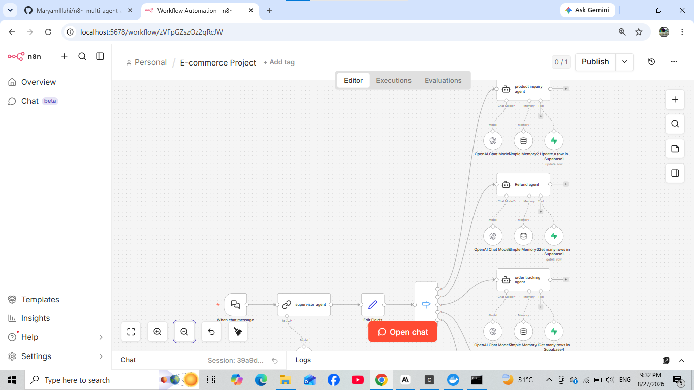
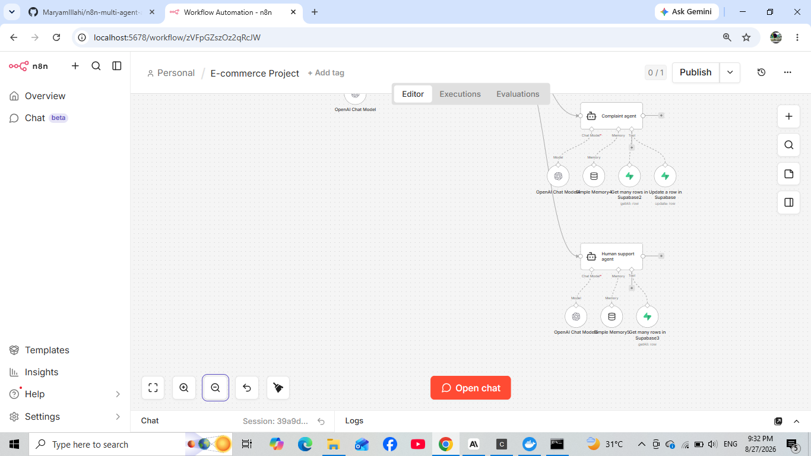

# 🤖 AI E-Commerce Multi-Agent System

An AI-powered **Multi-Agent E-Commerce Customer Support System** built with **n8n, OpenAI, and Supabase**.

The system uses a **Supervisor Agent** to understand customer requests and automatically route them to the appropriate specialized AI agent.

Each agent is responsible for a specific area of e-commerce support, making the system organized, scalable, and efficient.

## 🚀 Project Overview

This project demonstrates how a **Multi-Agent AI Architecture** can automate different customer support tasks in an e-commerce environment.

Instead of using one AI agent for everything, the system uses multiple specialized agents managed by a central **Supervisor Agent**.

### Main Workflow

**Customer Message → Supervisor Agent → Intent Detection → Agent Routing → Specialized Agent → Supabase / Tools → Customer Response**

## 🧠 AI Agents

### 👨‍💼 1. Supervisor Agent

The Supervisor Agent acts as the central controller of the system.

It analyzes the customer's request and routes it to the appropriate specialized agent.

It handles intent routing for:

- Product Inquiry
- Order Tracking
- Refund
- Complaint
- Human Support

The Supervisor also uses conversation context to maintain the user's intent across follow-up messages.

**Example:**

User: I want a refund.

Assistant: Please provide your Order ID.

User: ORD002

→ Refund Agent

## 🛍️ Product Inquiry Agent

Handles product-related customer requests such as:

- Product recommendations
- Product prices
- Product availability
- Product features
- Product comparisons
- Product specifications

## 📦 Order Tracking Agent

Handles order and delivery-related requests such as:

- Order status
- Shipping information
- Tracking numbers
- Estimated delivery dates
- Order tracking using Order ID

The agent retrieves order information from Supabase using the connected database tool.

## 💰 Refund Agent

Handles refund and return-related requests such as:

- Refund requests
- Refund status
- Refund amount
- Refund method
- Return requests
- Refund-related cancellation requests

The agent can retrieve and update refund information using Supabase.

## ⚠️ Complaint Agent

Handles customer complaints including:

- Damaged products
- Wrong products
- Defective products
- Complaint details
- Complaint status
- Complaint updates
- Complaint escalation

The agent can retrieve existing complaints and update complaint information.

Supported complaint statuses:

- Open
- In Progress
- Resolved
- Closed

## 👩‍💻 Human Support Agent

Handles requests where customers want to speak with a human representative.

Examples:

- "I want to talk to a human."
- "Connect me with support."
- "I need to speak with customer support."

## 🔄 Workflow Architecture

The system follows a **Supervisor-based Multi-Agent Architecture**.

**Customer Message → Supervisor Agent → Intent Routing → Specialized Agent → Supabase / Tools → Response**

The Supervisor Agent determines the customer's intent and routes the request to the appropriate specialized agent.

Each specialized agent has its own instructions, memory, and tools according to its responsibility.

## 📸 Workflow Screenshots

### Complete Multi-Agent Workflow

The complete n8n workflow showing the Supervisor Agent, routing logic, and specialized AI agents.

### Supervisor Agent & Routing

The Supervisor Agent analyzes the customer's request and routes it to the appropriate agent.

### Specialized AI Agents

Overview of the specialized agents responsible for different e-commerce tasks.

### Agent Tools & Integrations

The agents are connected with AI models, memory, and Supabase tools to perform their assigned tasks.

## 🎥 Project Demo

The demo shows the multi-agent system handling different e-commerce customer requests and routing them to the appropriate AI agent.

### Demo Includes

- Product inquiries
- Order tracking
- Refund requests
- Complaint handling
- Human support
- Follow-up conversations
- Intent-based agent routing
- Supabase database operations

### ▶️ Demo Video

[Watch the Project Demo](./Ecommerce%20Demo.mp4)

## 🛠️ Tech Stack

- **n8n** — Workflow automation and AI agent orchestration
- **OpenAI** — AI language models
- **Supabase** — Database and data management
- **AI Agents** — Specialized customer support
- **Switch Node** — Intent-based routing
- **Simple Memory** — Conversation context

## ✨ Key Features

- 🤖 Multi-Agent AI Architecture
- 🧠 Supervisor-Based Intent Routing
- 🔀 Automatic Agent Selection
- 🛍️ Product Inquiry
- 📦 Order Tracking
- 💰 Refund Management
- ⚠️ Complaint Management
- 👩‍💻 Human Support
- 🗄️ Supabase Integration
- 🧠 Conversation Memory
- 🔄 Context-Aware Follow-Ups
- ⚙️ n8n Automation

## 💬 Example Requests

| Customer Request | Agent |
|---|---|
| I want to buy a laptop | Product Inquiry Agent |
| Can you track my order? | Order Tracking Agent |
| I want a refund | Refund Agent |
| I received a damaged product | Complaint Agent |
| I want to talk to a human | Human Support Agent |

## 🔄 Context-Aware Conversations

The system can maintain the intent of a conversation across multiple messages.

**Example:**

> **User:** I want a refund.  
> **Assistant:** Please provide your Order ID.  
> **User:** ORD002.

The system understands that `ORD002` is a follow-up to the refund request and continues with the **Refund Agent**.

## ⚙️ How It Works

1. The customer sends a message.
2. The Supervisor Agent analyzes the request.
3. The request is classified into an intent.
4. The Switch node routes it to the correct agent.
5. The specialized agent processes the request.
6. The agent uses Supabase/tools when required.
7. The final response is returned to the customer.

## 📁 Project Structure

n8n-multi-agent-ai-system/
│
├── E-commerce Project.json
├── workflow.png
├── supervisor agent.png
├── agents.png
├── Agents..png
├── Ecommerce Demo.mp4
└── README.md

## 🎯 Project Goal

The goal of this project is to demonstrate how **Multi-Agent AI Systems** can automate different e-commerce customer support tasks.

By assigning each task to a specialized AI agent and using a Supervisor Agent for intelligent routing, the system provides a structured, scalable, and efficient approach to customer support automation.

## 👩‍💻 Author

**Maryam Illahi**

AI Automation | AI Agents | n8n Workflow Development
